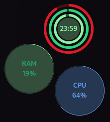
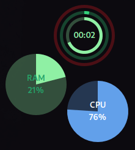

## Circular Widgets

A GNOME Shell extension to provide conky like widgets on gnome shell with few customization options, this extension aims to show system information on desktop.

 
 

### Feature Changes

* Drag and Drop have been disabled because I wasn't sure how to fix it.

### Development

**Requirements:**
* [`node`](https://nodejs.org/)
* [`pnpm`](https://pnpm.io/)
* `make`

```sh
make install
```

### Credits

This is a fork of https://github.com/raihan2000/circular-widgets that supports (only) GNOME 45.
