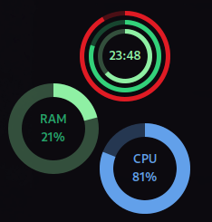
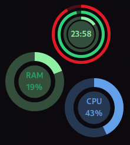

### Circular Widgets

A GNOME Shell extension to provide conky like widgets on gnome shell with few customization options, this extension aims to show system information on desktop.

This is a fork of https://github.com/raihan2000/circular-widgets with GNOME 45 support.

 
 

Many feature will be added in the future


### Development

```sh
make install
```

### Credits

This is a fork of https://github.com/raihan2000/circular-widgets with GNOME 45 support.
